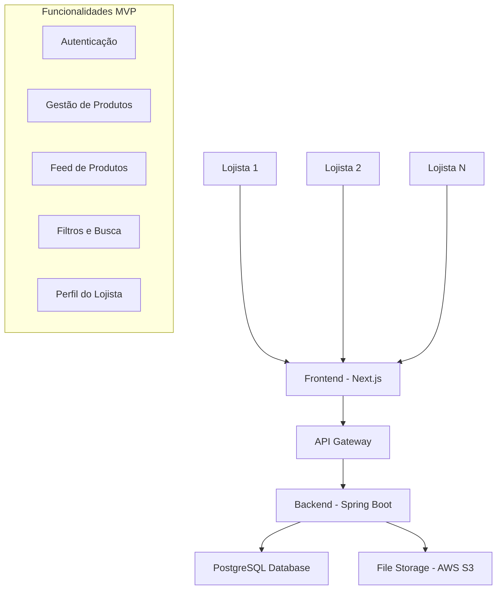
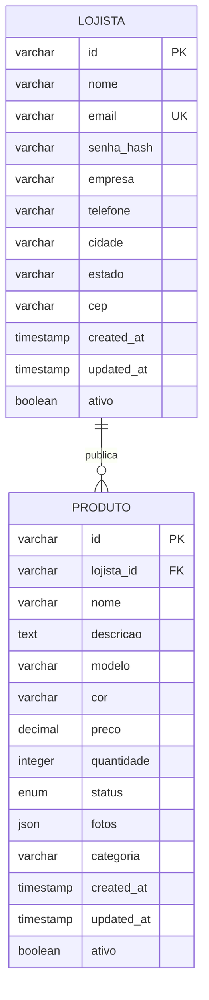
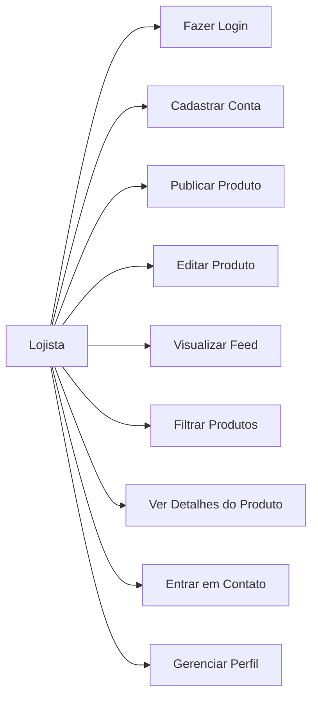
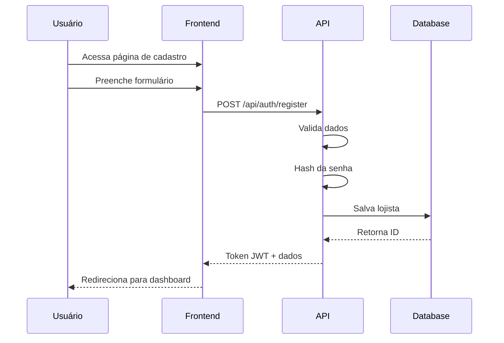
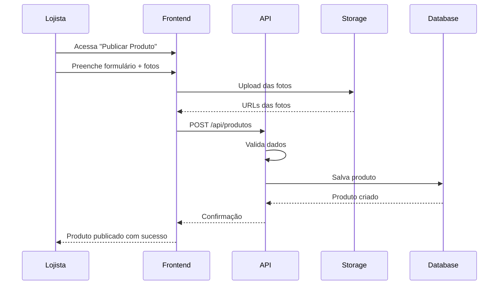
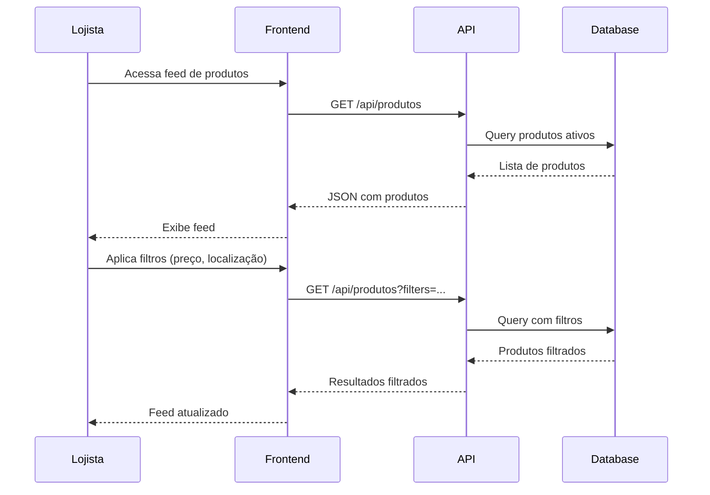

# MVP Contact B2B - Documentação Técnica
## Marketplace B2B para Lojistas de Produtos Eletrônicos

---

## 📋 Visão Geral do Projeto

O **Contact B2B** é um marketplace que conecta lojistas para compartilhamento e negociação de estoques de produtos eletrônicos (celulares, notebooks e acessórios). Este documento descreve o MVP (Minimum Viable Product) para validação do conceito.

### Objetivos do MVP
- ✅ Permitir publicação de produtos pelos lojistas
- ✅ Criar feed público de produtos disponíveis
- ✅ Implementar sistema de filtros básicos
- ✅ Facilitar contato entre lojistas interessados
- ✅ Validar o modelo de negócio B2B

---

## 🏗️ Arquitetura do Sistema



---

## 📊 Modelagem de Dados

### Diagrama ER (Entidade-Relacionamento)



### Especificação das Entidades

#### Tabela: LOJISTA
| Campo | Tipo | Constraints | Descrição |
|-------|------|-------------|-----------|
| id | VARCHAR(36) | PRIMARY KEY | UUID do lojista |
| nome | VARCHAR(100) | NOT NULL | Nome do proprietário |
| email | VARCHAR(150) | UNIQUE, NOT NULL | Email de login |
| senha_hash | VARCHAR(255) | NOT NULL | Hash da senha (bcrypt) |
| empresa | VARCHAR(200) | NOT NULL | Nome da empresa |
| telefone | VARCHAR(20) | NOT NULL | Telefone para contato |
| cidade | VARCHAR(100) | NOT NULL | Cidade da loja |
| estado | VARCHAR(2) | NOT NULL | UF do estado |
| cep | VARCHAR(10) | NOT NULL | CEP da loja |
| created_at | TIMESTAMP | DEFAULT NOW() | Data de cadastro |
| updated_at | TIMESTAMP | DEFAULT NOW() | Última atualização |
| ativo | BOOLEAN | DEFAULT TRUE | Status da conta |

#### Tabela: PRODUTO
| Campo | Tipo | Constraints | Descrição |
|-------|------|-------------|-----------|
| id | VARCHAR(36) | PRIMARY KEY | UUID do produto |
| lojista_id | VARCHAR(36) | FK REFERENCES lojista(id) | Proprietário do produto |
| nome | VARCHAR(200) | NOT NULL | Nome do produto |
| descricao | TEXT | NULL | Descrição detalhada |
| modelo | VARCHAR(100) | NOT NULL | Modelo/marca |
| cor | VARCHAR(50) | NOT NULL | Cor do produto |
| preco | DECIMAL(10,2) | NOT NULL, > 0 | Preço em reais |
| quantidade | INTEGER | NOT NULL, >= 0 | Quantidade disponível |
| status | ENUM | 'disponivel','vendido','reservado' | Status atual |
| fotos | JSON | NULL | Array de URLs das fotos |
| categoria | VARCHAR(50) | NOT NULL | celular, notebook, acessorio |
| created_at | TIMESTAMP | DEFAULT NOW() | Data de publicação |
| updated_at | TIMESTAMP | DEFAULT NOW() | Última atualização |
| ativo | BOOLEAN | DEFAULT TRUE | Produto ativo/inativo |

### Índices Sugeridos
```sql
-- Índices para performance
CREATE INDEX idx_produto_lojista ON produto(lojista_id);
CREATE INDEX idx_produto_status ON produto(status);
CREATE INDEX idx_produto_categoria ON produto(categoria);
CREATE INDEX idx_produto_preco ON produto(preco);
CREATE INDEX idx_produto_created_at ON produto(created_at DESC);
CREATE INDEX idx_lojista_cidade_estado ON lojista(cidade, estado);
```

---

## 🔄 Casos de Uso Principais

### Diagrama de Casos de Uso



### Fluxos Detalhados

#### 1. Fluxo de Cadastro de Lojista



#### 2. Fluxo de Publicação de Produto



#### 3. Fluxo de Busca e Filtros



---

## 🚀 Especificação da API REST

### Endpoints Principais

#### Autenticação
```http
POST /api/auth/register
POST /api/auth/login
POST /api/auth/refresh
DELETE /api/auth/logout
```

#### Lojistas
```http
GET /api/lojistas/perfil
PUT /api/lojistas/perfil
GET /api/lojistas/{id}
```

#### Produtos
```http
GET /api/produtos
POST /api/produtos
GET /api/produtos/{id}
PUT /api/produtos/{id}
DELETE /api/produtos/{id}
GET /api/produtos/meus
```

### Detalhamento dos Endpoints

#### `POST /api/auth/register`
**Request Body:**
```json
{
  "nome": "João Silva",
  "email": "joao@loja.com",
  "senha": "senha123",
  "empresa": "Loja do João",
  "telefone": "(11) 99999-9999",
  "cidade": "São Paulo",
  "estado": "SP",
  "cep": "01234-567"
}
```

**Response (201):**
```json
{
  "success": true,
  "data": {
    "token": "eyJhbGciOiJIUzI1NiIsInR5cCI6IkpXVCJ9...",
    "lojista": {
      "id": "550e8400-e29b-41d4-a716-446655440000",
      "nome": "João Silva",
      "email": "joao@loja.com",
      "empresa": "Loja do João"
    }
  }
}
```

#### `GET /api/produtos`
**Query Parameters:**
- `page` (default: 1)
- `limit` (default: 20)
- `cidade` (string)
- `estado` (string)
- `precoMin` (number)
- `precoMax` (number)
- `categoria` (enum)
- `status` (default: 'disponivel')

**Response (200):**
```json
{
  "success": true,
  "data": {
    "produtos": [
      {
        "id": "550e8400-e29b-41d4-a716-446655440001",
        "nome": "iPhone 15 Pro",
        "descricao": "iPhone novo, na caixa",
        "modelo": "A3101",
        "cor": "Azul Titânio",
        "preco": 7999.99,
        "quantidade": 5,
        "status": "disponivel",
        "fotos": [
          "https://storage.com/foto1.jpg",
          "https://storage.com/foto2.jpg"
        ],
        "categoria": "celular",
        "lojista": {
          "nome": "João Silva",
          "empresa": "Loja do João",
          "cidade": "São Paulo",
          "estado": "SP",
          "telefone": "(11) 99999-9999"
        },
        "createdAt": "2025-10-07T10:30:00Z"
      }
    ],
    "pagination": {
      "currentPage": 1,
      "totalPages": 5,
      "totalItems": 95,
      "hasNext": true,
      "hasPrev": false
    }
  }
}
```

#### `POST /api/produtos`
**Request Body:**
```json
{
  "nome": "MacBook Air M2",
  "descricao": "MacBook Air com chip M2, 8GB RAM, 256GB SSD",
  "modelo": "MLY33BZ/A",
  "cor": "Cinza Espacial",
  "preco": 8999.99,
  "quantidade": 2,
  "categoria": "notebook",
  "fotos": [
    "https://storage.com/macbook1.jpg",
    "https://storage.com/macbook2.jpg"
  ]
}
```

**Response (201):**
```json
{
  "success": true,
  "data": {
    "id": "550e8400-e29b-41d4-a716-446655440002",
    "message": "Produto criado com sucesso"
  }
}
```

### Códigos de Status HTTP

| Status | Descrição | Uso |
|--------|-----------|-----|
| 200 | OK | Operação bem-sucedida |
| 201 | Created | Recurso criado |
| 400 | Bad Request | Dados inválidos |
| 401 | Unauthorized | Token inválido/expirado |
| 403 | Forbidden | Sem permissão |
| 404 | Not Found | Recurso não encontrado |
| 409 | Conflict | Email já cadastrado |
| 500 | Internal Server Error | Erro interno |

---

## 🎨 Estrutura do Frontend (Next.js)

### Organização de Pastas
```
src/
├── app/
│   ├── (auth)/
│   │   ├── login/
│   │   └── register/
│   ├── dashboard/
│   ├── publicar/
│   ├── meus-produtos/
│   ├── perfil/
│   ├── produto/[id]/
│   ├── globals.css
│   └── layout.tsx
├── components/
│   ├── ui/
│   │   ├── Button.tsx
│   │   ├── Input.tsx
│   │   ├── Modal.tsx
│   │   └── Card.tsx
│   ├── layout/
│   │   ├── Header.tsx
│   │   ├── Footer.tsx
│   │   └── Sidebar.tsx
│   ├── produto/
│   │   ├── ProductCard.tsx
│   │   ├── ProductForm.tsx
│   │   ├── ProductFilters.tsx
│   │   └── ProductGrid.tsx
│   └── auth/
│       ├── LoginForm.tsx
│       └── RegisterForm.tsx
├── lib/
│   ├── api.ts
│   ├── auth.ts
│   ├── utils.ts
│   └── validations.ts
├── hooks/
│   ├── useAuth.ts
│   ├── useProdutos.ts
│   └── useFilters.ts
├── types/
│   └── index.ts
└── constants/
    └── index.ts
```

### Páginas Principais

#### 1. Dashboard (Feed de Produtos)
- **Rota**: `/dashboard`
- **Funcionalidades**:
  - Grid de produtos
  - Filtros laterais
  - Paginação
  - Busca por nome

#### 2. Publicar Produto
- **Rota**: `/publicar`
- **Funcionalidades**:
  - Formulário completo
  - Upload múltiplo de imagens
  - Preview das fotos
  - Validação em tempo real

#### 3. Meus Produtos
- **Rota**: `/meus-produtos`
- **Funcionalidades**:
  - Lista dos produtos do lojista
  - Editar/excluir produtos
  - Alterar status
  - Estatísticas básicas

#### 4. Perfil do Lojista
- **Rota**: `/perfil`
- **Funcionalidades**:
  - Editar dados pessoais
  - Alterar senha
  - Configurações da conta

### Componentes Principais

#### ProductCard.tsx
```typescript
interface ProductCardProps {
  produto: Produto;
  onContactClick: (lojista: Lojista) => void;
}
```

#### ProductFilters.tsx
```typescript
interface ProductFiltersProps {
  filters: FiltrosProdutos;
  onFiltersChange: (filters: FiltrosProdutos) => void;
  estados: string[];
  cidades: string[];
}
```

### Estados Globais (Context API)
- **AuthContext**: Dados do usuário logado
- **ProductsContext**: Lista de produtos e filtros
- **UIContext**: Estados da interface (loading, modals)

---

## 🔐 Requisitos Não-Funcionais

### Segurança
- ✅ Autenticação JWT
- ✅ Hash de senhas com bcrypt
- ✅ Validação de inputs (XSS, SQL Injection)
- ✅ Rate limiting nas APIs
- ✅ HTTPS obrigatório em produção
- ✅ Sanitização de uploads de imagem

### Performance
- ✅ Paginação de produtos (20 itens por página)
- ✅ Cache de imagens no CDN
- ✅ Lazy loading de componentes
- ✅ Otimização de queries no banco
- ✅ Compressão de imagens automática

### Escalabilidade
- ✅ Arquitetura stateless
- ✅ Banco de dados indexado
- ✅ Separação frontend/backend
- ✅ Preparado para containerização
- ✅ API RESTful padronizada

### Usabilidade
- ✅ Interface responsiva (mobile-first)
- ✅ Feedback visual das ações
- ✅ Loading states
- ✅ Tratamento de erros amigável
- ✅ Acessibilidade básica (WCAG)

---

## 📱 Wireframes das Telas Principais

### Dashboard - Feed de Produtos
```
┌─────────────────────────────────────────────────────────────┐
│ Header: Contact B2B | Feed | Meus Produtos | Publicar | ⚙️  │
├─────────────────────────────────────────────────────────────┤
│ ┌─ Filtros ─┐ ┌─── Grid de Produtos ──────────────────────┐ │
│ │ Localização│ │ ┌──────┐ ┌──────┐ ┌──────┐ ┌──────┐    │ │
│ │ Estado: SP ▼│ │ │ [IMG]│ │ [IMG]│ │ [IMG]│ │ [IMG]│    │ │
│ │ Cidade: ___ │ │ │iPhone│ │Galaxy│ │MacBook│ │Cabo │    │ │
│ │            │ │ │R$7999│ │R$4599│ │R$8999│ │R$25 │    │ │
│ │ Preço      │ │ │SP-SP │ │RJ-RJ │ │SP-SP │ │MG-BH│    │ │
│ │ Min: ___   │ │ └──────┘ └──────┘ └──────┘ └──────┘    │ │
│ │ Max: ___   │ │                                        │ │
│ │            │ │ ┌──────┐ ┌──────┐ ┌──────┐ ┌──────┐    │ │
│ │ Categoria  │ │ │ [IMG]│ │ [IMG]│ │ [IMG]│ │ [IMG]│    │ │
│ │ [x] Celular│ │ │AirPods│ │Dell │ │Mouse │ │Fone │    │ │
│ │ [x] Notebook│ │ │R$899 │ │R$3299│ │R$150 │ │R$89 │    │ │
│ │ [x] Acessór│ │ │SP-SP │ │RS-POA│ │SP-SP │ │RJ-RJ│    │ │
│ └────────────┘ │ └──────┘ └──────┘ └──────┘ └──────┘    │ │
│                └─────────────────────────────────────────┘ │
│                ← 1 2 3 4 5 ... 10 →                       │
└─────────────────────────────────────────────────────────────┘
```

### Publicar Produto
```
┌─────────────────────────────────────────────────────────────┐
│ Header: Contact B2B | ← Voltar                             │
├─────────────────────────────────────────────────────────────┤
│ ┌─ Publicar Novo Produto ─────────────────────────────────┐ │
│ │                                                         │ │
│ │ Nome do Produto: [________________________]            │ │
│ │                                                         │ │
│ │ Descrição: [_________________________________________]  │ │
│ │           [_________________________________________]  │ │
│ │                                                         │ │
│ │ Modelo: [_______________] Cor: [_______________]        │ │
│ │                                                         │ │
│ │ Preço: R$ [___________] Quantidade: [_____]            │ │
│ │                                                         │ │
│ │ Categoria: [Celular ▼]                                 │ │
│ │                                                         │ │
│ │ Fotos do Produto:                                       │ │
│ │ ┌─────┐ ┌─────┐ ┌─────┐ ┌─────┐                       │ │
│ │ │ [+] │ │     │ │     │ │     │                       │ │
│ │ │ Add │ │     │ │     │ │     │                       │ │
│ │ └─────┘ └─────┘ └─────┘ └─────┘                       │ │
│ │                                                         │ │
│ │              [Cancelar] [Publicar Produto]             │ │
│ └─────────────────────────────────────────────────────────┘ │
└─────────────────────────────────────────────────────────────┘
```

---

## 🚦 Roadmap de Desenvolvimento

### Fase 1 - MVP Core (2-3 semanas)
- [ ] Setup do projeto Next.js + TypeScript
- [ ] Autenticação (login/registro)
- [ ] CRUD de produtos
- [ ] Feed básico de produtos
- [ ] Filtros simples (preço, localização)

### Fase 2 - UX/UI (1-2 semanas)
- [ ] Design system e componentes
- [ ] Responsividade mobile
- [ ] Upload e preview de imagens
- [ ] Loading states e feedback

### Fase 3 - Backend Integration (2-3 semanas)
- [ ] API Spring Boot
- [ ] Banco PostgreSQL
- [ ] Autenticação JWT
- [ ] Storage de imagens

### Fase 4 - Melhorias (1-2 semanas)
- [ ] Busca textual
- [ ] Ordenação avançada
- [ ] Perfil do lojista
- [ ] Estatísticas básicas

---

## 🧪 Critérios de Validação do MVP

### Métricas de Sucesso
1. **Cadastro de Lojistas**: >= 10 lojistas ativos
2. **Produtos Publicados**: >= 50 produtos no feed
3. **Engajamento**: >= 5 contatos por dia entre lojistas
4. **Usabilidade**: Tempo médio para publicar produto < 3 minutos
5. **Performance**: Carregamento da página < 2 segundos

### Testes de Validação
- [ ] Lojista consegue se cadastrar sem dificuldades
- [ ] Publicação de produto é intuitiva e rápida
- [ ] Filtros retornam resultados relevantes
- [ ] Informações de contato são facilmente acessíveis
- [ ] Sistema funciona bem em dispositivos móveis

---

## 📞 Próximos Passos

1. **Validar documentação** com stakeholders
2. **Criar protótipo navegável** no Figma
3. **Setup do ambiente** de desenvolvimento
4. **Implementar autenticação** como primeira feature
5. **Desenvolver CRUD** de produtos
6. **Criar feed** básico com filtros
7. **Testes com usuários** reais (lojistas)
8. **Iterate** baseado no feedback

---

*Documentação criada em: 07/10/2025*  
*Versão: 1.0 - MVP Contact B2B*
